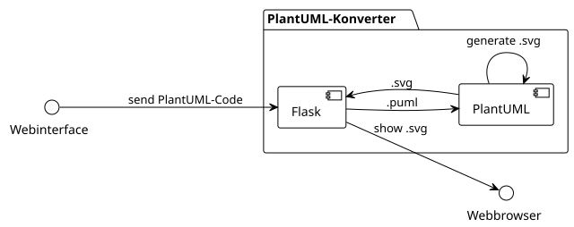

# 📘 Projektdokumentation (DOKU.md)

---

## 🔁 Wiedereinstieg: Git-Befehle

```bash
git clone <repo-url>
git branch -a
git checkout <branchname>
git add .
git commit -m "Message"
git push
```

---

## 🧠 Arbeiten mit KI (Prompt-gestützter Workflow)

### Ziel: KI sinnvoll einsetzen für Debugging, Analyse, Dokumentation

**Typischer Ablauf:**

1. 🔐 `.gitignore` sauber halten → z. B. `.tar.gz`, `.env`, `__pycache__/` ignorieren
2. 📦 Projekt zippen oder als `.tar.gz` verpacken:
   ```bash
   git archive --format=tar.gz -o project.tar.gz HEAD #tar --exclude='.git' -czf projekt.tar.gz .
   ```
3. 🧠 Zip im KI-Chat hochladen mit kurzer Aufgabenbeschreibung (z. B. "optimiere meinen Dockerfile + dokumentiere in DOKU.md").
4. 💬 Antworten & Empfehlungen speichern (z. B. als `DOKU.md` erweitern).
5. ✍️ Fragen & Prompts mitprotokollieren zur Nachvollziehbarkeit.

### 📌 Beispiel-Prompt für KI:
- Bitte analysiere den beigefügten Projekt-Export und bearbeite die To-Dos aus der README.md
- Gliedere alle in diesem Chat enthaltenen Fragen folgende Kategorien: Git, Docker, Python, Architektur, Doku. Gib eine kurze Zusammenfassung jeder Kategorie."
---

## ⚙️ Kommunikation zwischen Containern debuggen (Docker Compose)

### 🔍 Problem: Container erreichen sich nicht (z. B. `fetch('http://localhost:5000')` schlägt fehl)

### ✅ Lösung:
- Verwende den **Servicenamen aus `docker-compose.yml`** → z. B. `http://backend:5000`
- `localhost` ist **innerhalb eines Containers nicht der Host**, sondern der Container selbst.

### 🧰 Nützliche Debug-Kommandos:

```bash
# Logs eines Containers anzeigen
docker-compose logs backend

# Interaktiv in Container springen
docker exec -it <container-name> sh   # oder bash

# Verbindung zu anderem Container testen (z. B. von frontend zu backend)
apk add curl        # ggf. vorher im Container installieren
curl http://backend:5000
```

📦 Wenn du im `frontend`-Container bist und `curl http://backend:5000` funktioniert, dann ist die Verbindung ok.

---

## 🧠 Architektur



**Microservices:**
- `frontend-uS`: zeigt Eingabeformular und SVG
- `backend-uS`: rendert PlantUML via Java

Weitere Infos:
- [Frontend Info](frontend-uS/info.md)
- [Backend Info](backend-uS/info.md)

---

## 📁 Git: Neue & entfernte Dateien verwalten

### 🆕 Neue Dateien hinzufügen:

```bash
git add .
git commit -m "Neue Struktur übernommen"
git push
```

### 🗑️ Entfernte Dateien aktualisieren:

```bash
git add -u
git commit -m "Dateien verschoben oder entfernt"
git push
```

---