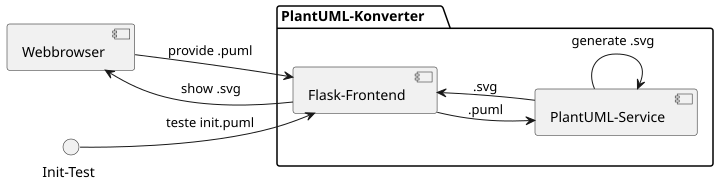

# PlantUML Web Generator

Ein **einfaches Web-Interface** zur Erstellung von UML-Diagrammen mit PlantUML – vollständig dockerisiert, mit REST-Service und Webfrontend.

---

## 🚀 Features

- ✍ UML-Code im Browser eingeben und als **SVG-Diagramm** generieren
- 🖥 Zwei getrennte Container:
  - `flask-frontend` für Web-Eingabe & Verarbeitung
  - `plantuml-service` zum Rendern der Diagramme via REST
- 📦 Bereitstellung via Docker-Compose
- 🔄 Diagramme werden als `.svg` zur Laufzeit erzeugt
- 🔌 Klar getrennte Schnittstellen – erweiterbar für CI/CD

---

## 🧠 Architektur



- **[Webinterface]('http://localhost:5000')**: Ein- und Ausgabe-Element des PlantUMLs
- **[Flask-Frontend](flask-frontend/info.md)**: für Web-Eingabe & Verarbeitung
- **[PlantUML-Service](plantUML-service/info.md)**: zum Rendern der Diagramme via REST

---

## 📂 Projektstruktur

```text
projekt/
├── docker-compose.yml             # Docker-Setup für beide Services
├── DOKU.md                        # Projektdokumentation
├── README.md                      # Diese Datei
├── .gitignore
├── Doku.svg                       # Architektur
├── uml_data/                      # 📌 Wird zur Laufzeit befüllt mit .puml/.svg
│   └── diagram.puml
├── plantuml-service/             # REST-Renderer (.puml -> .svg)
│   ├── Dockerfile
│   ├── .dockerignore
│   ├── requirements.txt
│   └── app.py
└── flask-frontend/               # Webinterface & Nutzerinteraktion
    ├── Dockerfile
    ├── app.py
    ├── requirements.txt
    ├── init.puml
    ├── .dockerignore
    └── info.md
```

---

## ⚙️ Installation & Verwendung

### ▶️ Start mit Docker Compose (empfohlen)

Voraussetzung: [Docker & Docker Compose](https://docs.docker.com/compose/install/) installiert.

```bash
# Im Projektverzeichnis:
docker-compose up --build
```

Dann im Browser öffnen:  
👉 [http://localhost:5000](http://localhost:5000)

---

## 🧪 REST-API (plantuml-service)

Der `plantuml-service` stellt folgende Schnittstelle bereit:

```
POST /render
Content-Type: text/plain
Body: PlantUML-Code
→ Rückgabe: SVG-Diagramm (image/svg+xml)
```

Kann z. B. mit `curl` getestet werden:

```bash
curl -X POST http://localhost:8080/render \
     -H "Content-Type: text/plain" \
     --data-binary "@startuml\nAlice -> Bob : Hello\n@enduml" \
     > out.svg
```

---

## 🧰 Manuelle Ausführung ohne Compose (nicht empfohlen)

Möglich, aber ...:

```bash
# Terminal 1
cd plantuml-service
docker build -t plantuml-service .
docker run -p 8080:8080 plantuml-service

# Terminal 2
cd flask-frontend
docker build -t flask-frontend .
docker run -p 5000:5000 -v $(pwd)/../uml_data:/uml flask-frontend
```

---

## 🛠 Entwicklung & Debugging

Container-Logs anzeigen:
```bash
docker-compose logs -f
```

Shell im Container öffnen:
```bash
docker exec -it flask-frontend-1 bash
```

---

## 🏗️ To-Do / Ideen

- 📈 CI/CD mit GitHub Actions
- 🖼 Diagramm-Historie oder Speicherfunktion
- 🌌 Mermaid-Support als Alternative zu PlantUML
- 🎨 Webinterface mit Themes

---

## 📄 Lizenz

MIT-Lizenz